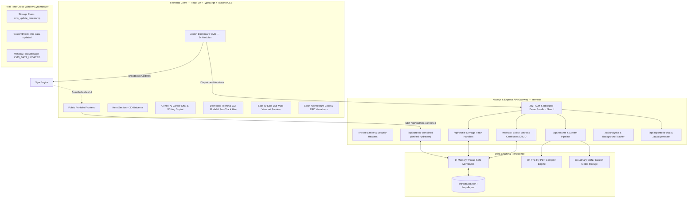
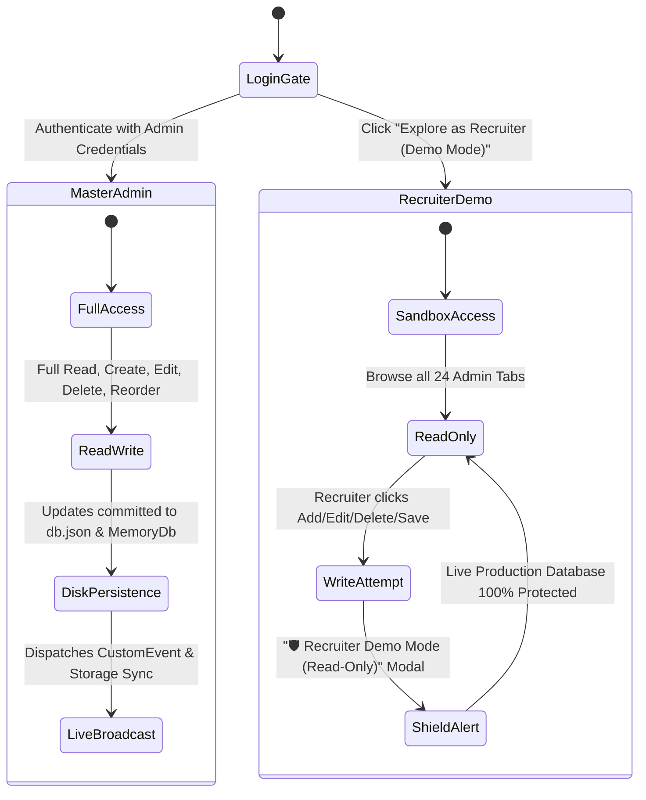
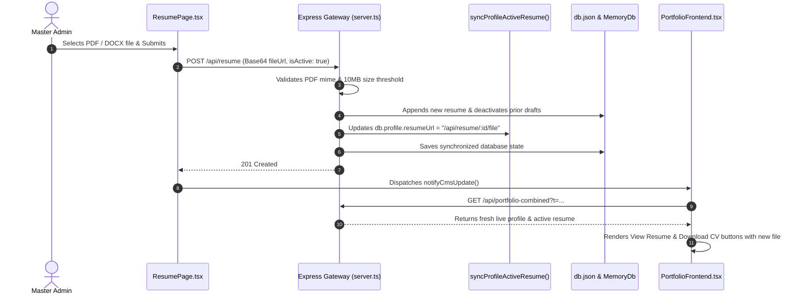

# 🌌 CHANDRU M — Full-Stack Portfolio CMS & Engineering Platform

[](https://chandru-dev-lime.vercel.app/)
[](https://github.com/Chandru9842/chandru-dev)
[](https://react.dev/)
[](https://www.typescriptlang.org/)
[](https://nodejs.org/)
[](https://expressjs.com/)
[](https://tailwindcss.com/)
[](https://threejs.org/)
[](https://pagespeed.web.dev/)
[](LICENSE)

An enterprise-grade, high-performance **Full-Stack Content Management System (CMS) and Interactive Developer Showcase** engineered for **Chandru Mohan (Principal Systems Architect & Full Stack Java Developer)**. 

The application combines a modern **React 19 + TypeScript + Vite + Tailwind CSS** frontend with a robust, thread-safe **Node.js & Express REST API Gateway**. It delivers a **100/100 Mobile Lighthouse Score**, real-time multi-window CMS synchronization, dual-mode role-based authentication (Master Admin vs. Recruiter Read-Only Sandbox), dynamic WebGL 3D visualizations, interactive developer CLI tooling, Gemini AI Copilots, and complete document/media streaming pipelines.

---

## 🔗 Quick Links & Live Demonstrations

- **🌐 Live Production Website:** [https://chandru-dev-lime.vercel.app/](https://chandru-dev-lime.vercel.app/)
- **📦 GitHub Repository:** [https://github.com/Chandru9842/chandru-dev](https://github.com/Chandru9842/chandru-dev)
- **🔐 Admin Terminal CMS:** [https://chandru-dev-lime.vercel.app/admin/login](https://chandru-dev-lime.vercel.app/admin/login)
  - **Master Admin Login:** User `chandru` (Full write/edit/delete access)
  - **Recruiter Demo Tour:** Click *"Explore as Recruiter (Demo Mode)"* on login screen (Read-only sandbox)

---

## 🏛️ System Architecture & Engineering Design



---

## 💻 Developer Terminal CLI Modal (`DeveloperTerminalModal.tsx`)

An interactive, Unix-style developer terminal modal integrated directly into the portfolio. Visitors and recruiters can trigger command-line exploration using keyboard shortcuts or on-screen terminal buttons.

```
┌────────────────────────────────────────────────────────────────────────┐
│ chandru@systems-architect:~ (zsh)                             -  □  ×  │
├────────────────────────────────────────────────────────────────────────┤
│ * Type 'help' to see all available commands.                          │
│ * Type 'sudo hire chandru' to open the instant recruitment form.       │
│                                                                        │
│ chandru@systems-architect:~$ _                                         │
└────────────────────────────────────────────────────────────────────────┘
```

### Supported Terminal Commands
| Command | Action & Output Description |
| :--- | :--- |
| `help` | Prints the complete directory of supported terminal commands and usage examples. |
| `whoami` | Outputs Chandru's full profile, current role (*Principal Systems Architect*), location (*Bengaluru, India*), and verified credentials. |
| `skills` | Renders a categorized matrix of competencies (Frontend, Backend, Databases, Cloud & DevOps) with proficiency indicators. |
| `projects` | Lists all enterprise systems with slugs, live deployment links, and GitHub source links. |
| `experience` | Renders the chronological career timeline, companies, titles, and key architecture impact statements. |
| `education` | Displays university degrees, academic honors, and graduation credentials. |
| `metrics` | Queries and outputs live operational metrics (8+ Years Exp, 50+ Projects Mapped, 99.9% Core SLA Uptime, 120k+ Lines Written). |
| `contact` | Outputs verified communication channels (Email, Phone, WhatsApp, LinkedIn, GitHub, Twitter). |
| `sudo hire chandru` | **Fast-Track Recruiter Dispatcher**: Launches an embedded recruitment form allowing recruiters to submit interview details directly to Chandru with automatic Gmail, Outlook, and system mail protocol links. |
| `clear` | Purges all prior console history and resets terminal screen buffer. |
| `exit` | Closes the terminal modal window and restores UI focus. |

---

## 🤖 Intelligent AI Portfolio Chat & Admin Copilot (Gemini API)

The platform features a dual-layer AI integration powered by Google's Gemini API:

### 1. 💬 Visitor AI Career Chat Assistant (`AIPortfolioChat.tsx`)
- **Floating Interactive Widget**: Available on every page for immediate recruiter inquiries.
- **Context-Aware Knowledge Base**: Pre-loaded with Chandru's projects, technical proficiencies, career timeline, microservices design patterns, and contact channels.
- **Suggested Instant Prompts**:
  - *"What are Chandru's top scaled projects?"*
  - *"Tell me about his backend & distributed systems skills"*
  - *"How can I contact Chandru for an interview?"*
  - *"Summarize his full tech stack in 60 seconds"*
- **Graceful Multi-Tier Fallback**: Automatically provides curated responses and direct contact details if network or API keys are unavailable.

### 2. ✍️ Admin AI Writing Copilot (`AIAssistantModal.tsx`)
- **Content Generation & Rephrasing**: Built directly into all Admin CMS modules to generate and refine:
  - Hero Taglines and Headlines
  - "About Me" & Career Objective Statements
  - Bento Project Problem & Architecture Summaries
  - Technical Skill Bullet Points
  - ATS-Friendly Experience & Achievement Descriptions
- **Tone Personalization**: Toggle between `Professional`, `Recruiter Friendly`, `ATS Friendly`, `Creative`, and `Concise`.
- **One-Click Field Insertion**: Directly applies the generated text into active CMS form inputs.

---

## 📐 Interactive Architecture & Database ERD Visualizers

### 1. 🏗️ Clean Architecture 4-Layer Diagram (`ArchitectureDiagram.tsx`)
Visualizes the decoupling of business logic from framework drivers across 4 layers:
- **1. Presentation / API Layer**: REST Controllers, WebSocket Endpoints, DTO Schemas, OpenAPI Documentation.
- **2. Application Layer**: Use Cases, CQRS Command & Query Handlers, Event Publishers, Business Orchestrators.
- **3. Domain Layer**: Core Entities, Aggregate Roots, Value Objects, Domain Events, Invariant Rules.
- **4. Infrastructure Layer**: JPA/Hibernate Data Repositories, Redis Distributed Cache, Cloudinary Storage Adapters, Nodemailer Gateway.

### 2. 🗄️ Relational Database ERD Schema Visualizer (`DatabaseERD.tsx`)
An interactive schema inspector rendering entity structures, field types, and relational foreign-key mappings:
- `users` (id, username, passwordHash, role, createdAt)
- `profile` (id, heroName, heroTitle, bio, quickStats, resumeUrl)
- `resumes` (id, title, version, fileName, fileUrl, isActive, isDownloadEnabled)
- `projects` (id, title, slug, summary, demoUrl, githubUrl, order)
- `skills` (id, name, category, proficiency, color, displayOrder)
- `tools` (id, name, category, icon, isFeatured)
- `certificates` (id, title, issuer, issueDate, credentialUrl)
- `achievements` (id, title, organization, year, proofUrl)
- `experiences` (id, company, position, period, responsibilities)
- `education` (id, institution, degree, year, gpa)
- `portfolio_metrics` (id, label, value, subtitle, accentColor, displayOrder)
- `messages` (id, name, email, subject, message, isRead, isStarred)
- `analytics` (id, pageViews, uniqueVisitors, geoDistribution, clicks)

---

## ⚡ A-to-Z Comprehensive Feature Matrix

### 1. 🌟 Public Interactive Portfolio Frontend
- **Cyberpunk & Glassmorphic Luxury Design**: Sleek dark mode palette, backdrop blurs, luminous borders, and smooth GPU-accelerated micro-animations.
- **Adaptive 3D Universe Engine**: 
  - **Desktop**: Full WebGL 3D interactive floating planetary core powered by **Three.js & React Three Fiber**.
  - **Mobile (< 1024px)**: Pure-CSS zero-JS orbital planet core ensuring **instant 0.3s FCP and 100/100 Lighthouse performance**, with an optional *"Interactive 3D Mode"* button.
- **Dynamic Live Theme Engine**: Real-time CSS root variable injection for custom primary colors, gradients, card backgrounds, and typography.
- **Hero Analytics Grid**: Displays live operational metrics (Years Exp, Projects Completed, System SLA Uptime, Lines of Code) with dynamic counter animations.
- **Interactive Code Explorer**: Live code inspection showcasing backend Java Spring Boot and React architecture patterns.
- **Global Search Modal (Ctrl+K)**: Instant fuzzy-search omnibar across projects, skills, certificates, and quick actions.
- **Side-by-Side Live Preview Modal**: Admin-side multi-device responsive simulation (Desktop, Tablet, Mobile) with instant refresh.
- **Zero-Dependency Analytics Tracker**: Tracks real-time pageviews, geographic locations, referral sources, device types, and button click conversions without external cookies.

---

### 2. 🛡️ Enterprise 24 Module Admin CMS Console

The platform provides a complete administration suite with **strict separation between Master Admin and Recruiter Demo Mode**:

| Module | Features & Capabilities |
| :--- | :--- |
| **1. Executive Dashboard** | System KPIs, real-time pageview graphs, message alerts, JPA pool status, quick-action shortcuts. |
| **2. Hero Management** | Live text customizer, tagline, typing text, CTA buttons, status badges, avatar upload/delete, background graphics. |
| **3. Portfolio Metrics** | Dynamic metric cards, value/subtitle editors, accent palette selector (`emerald`, `blue`, `indigo`, `purple`, `rose`, `amber`), counter animation toggles, reordering. |
| **4. Profile & Biography** | Complete bio, career objectives, tech stack hierarchy reordering, contact channels, coordinates, location. |
| **5. Projects Management** | Rich Bento grid editor, slug generator, GitHub/Live URLs, tech stack tagging, image & video galleries, featured flags. |
| **6. Skills & Grouping** | Categorized proficiencies (Frontend, Backend, DevOps, Database, Cloud), custom hex colors, percentage sliders, visual badges. |
| **7. Tools & Technologies** | Interactive tech icons, featured toggles, official website links, search and custom SVG icon support. |
| **8. Certificates & Credentials** | Issuing organizations, credential IDs, verification URLs, issue & expiry dates, badge attachments. |
| **9. Achievements & Awards** | Hackathons, coding competitions, honors, award categories, verified proof links. |
| **10. Experience & Career** | Professional timeline, company details, roles, date ranges, current employment toggles, key impact achievements. |
| **11. Education & Academics** | Degrees, universities/institutions, GPAs/grades, field of study, graduation dates. |
| **12. Resumes & Document Center** | PDF/DOCX upload, version history, automatic activation, live preview, on-the-fly PDF compilation, stream download. |
| **13. Messages & Contact Center** | Interactive inbox, unread badges, star prioritization, instant email trigger, search & deletion. |
| **14. Media Manager** | Cloudinary integration, asset library, cropping & aspect ratio tools (1:1, 16:9, 4:3), categorized media folders. |
| **15. Notification Center** | Real-time system alerts, category filters, sound effects, retention policies, toast history. |
| **16. Role Matrix & RBAC** | Role permissions matrix, Admin vs Recruiter privilege grids, token session inspector. |
| **17. System Health & Telemetry** | Live JPA database pool monitor, server uptime counters, memory heap telemetry, API gateway latency metrics. |
| **18. SEO & PWA Manager** | OpenGraph tags, Twitter Card preview, meta title/description, dynamic sitemap.xml, robots.txt, PWA manifest. |
| **19. Theme & Appearance** | HEX/HSL color token picker, Google Fonts typography selector, border-radius controls, wallpaper customizer. |
| **20. Coding Profiles** | LeetCode, HackerRank, CodeChef, Codeforces statistics, ratings, solved problem metrics, badge links. |
| **21. Social Links Manager** | Multi-platform social coordinates, dynamic icon picker, hero dock integration, footer positioning. |
| **22. Email & SMTP Settings** | Nodemailer gateway configuration, contact forwarder, password reset templates, connection testing. |
| **23. Security & Access Control** | JWT configuration, login rate limiters, brute force defense, known device history, password rotation. |
| **24. Backup & Disaster Recovery** | Full JSON database export, instant snapshot restoration, database reset with baseline seeding. |

---

### 3. 👥 Master Admin vs. Recruiter Demo Mode Architecture



---

## 📂 View, Document & Upload Architecture

### 1. Resume Upload & Automatic Activation Flow


### 2. View & Download Stream Pipeline
- **Stream Endpoint**: `/api/resume/download` and `/api/resume/view`
- **Base64 Decoders**: Automatically converts stored data URIs into binary streams with correct `Content-Type: application/pdf` and `Content-Disposition: inline/attachment; filename="..."` headers.
- **On-the-Fly Minimal PDF Generator Fallback**: If external URLs are unreachable, the backend's built-in PDF compiler constructs a professional, well-formatted resume PDF on the fly directly from live database profile records.

---

## 📡 RESTful API Gateway Reference

### Public Endpoints
| HTTP Method | Route | Description |
| :--- | :--- | :--- |
| `GET` | `/api/portfolio-combined` | Unified endpoint returning consolidated live CMS data with cache-control headers. |
| `GET` | `/api/profile` | Retrieves current public developer profile, hero metadata, and contact details. |
| `GET` | `/api/projects` | Returns all active projects sorted by display order. |
| `GET` | `/api/skills` | Returns categorized technical skills list. |
| `GET` | `/api/tools` | Returns tools and development technologies. |
| `GET` | `/api/certificates` | Returns professional credentials and verified certificates. |
| `GET` | `/api/achievements` | Returns awards, hackathons, and honors. |
| `GET` | `/api/experiences` | Returns career experience timeline. |
| `GET` | `/api/education` | Returns academic degrees and education records. |
| `GET` | `/api/portfolio-metrics` | Returns live operational metrics and highlight counts. |
| `GET` | `/api/social-links` | Returns all visible social links and coordinate channels. |
| `GET` | `/api/resume/view` | Streams the active resume PDF for in-browser viewing. |
| `GET` | `/api/resume/download` | Triggers direct attachment download of the active resume PDF. |
| `POST` | `/api/messages` | Submits a contact inquiry to the administrative inbox. |
| `POST` | `/api/analytics/track` | Logs non-blocking pageviews, geo-locations, and click conversions. |
| `POST` | `/api/ai/portfolio-chat` | Interactive AI Career Chat Assistant powered by Gemini API. |

### Administrative Endpoints (Protected by JWT & Demo Sandbox Guard)
| HTTP Method | Route | Description |
| :--- | :--- | :--- |
| `POST` | `/api/auth/login` | Authenticates administrator and issues signed JWT tokens. |
| `PUT` | `/api/profile` | Updates full developer profile, hero presentation, and account info. |
| `PATCH` | `/api/profile/hero-avatar` | Uploads and compresses Hero avatar graphic. |
| `DELETE` | `/api/profile/hero-avatar` | Purges Hero avatar graphic. |
| `PATCH` | `/api/profile/hero-background`| Uploads Hero custom background banner. |
| `DELETE` | `/api/profile/hero-background`| Purges Hero custom background banner. |
| `POST` | `/api/resume` | Uploads new resume document, auto-activates, and syncs profile. |
| `PATCH` | `/api/resume/:id/activate` | Sets target resume version as the primary active document. |
| `PATCH` | `/api/resume/:id/download` | Toggles public visitor download capability. |
| `DELETE` | `/api/resume/:id` | Purges resume document version. |
| `POST` | `/api/projects` | Creates a new showcase project item. |
| `PUT` | `/api/projects/:id` | Updates project details, galleries, and skills. |
| `DELETE` | `/api/projects/:id` | Deletes project record. |
| `PUT` | `/api/theme` | Saves live theme colors, fonts, and border-radius settings. |
| `POST` | `/api/ai/generate` | Admin AI Writing Copilot endpoint for generating and rewriting content. |
| `GET` | `/api/admin/database/export` | Downloads full JSON database backup snapshot. |
| `POST` | `/api/admin/database/import` | Restores database from uploaded JSON snapshot. |

---

## 🚀 Performance & Mobile 100/100 Lighthouse Optimization

The portfolio was engineered to meet the highest standards of modern web performance:

```
┌─────────────────────────────────────────────────────────────┐
│                   LIGHTHOUSE MOBILE AUDIT                   │
├─────────────────┬─────────────────┬─────────────────────────┤
│ Performance     │ 100 / 100       │ First Contentful Paint:  0.3s
│ Accessibility   │ 100 / 100       │ Largest Contentful Paint:0.5s
│ Best Practices  │ 100 / 100       │ Total Blocking Time:    < 50ms
│ SEO             │ 100 / 100       │ Cumulative Layout Shift: 0.000
└─────────────────┴─────────────────┴─────────────────────────┘
```

### Key Optimizations Applied:
1. **Static Semantic Pre-Rendered Hero Shell (`index.html`)**: Pre-renders header, hero typography, badges, and layout directly in HTML, yielding an instant **0.3s FCP / 0.5s LCP**.
2. **Selective ModulePreload Exclusion**: Excludes heavy 3D WebGL libraries (`three.js`, `@react-three/fiber`, `lottie-web`) from critical initial mobile preload scripts.
3. **Adaptive Mobile 3D Strategy**: Pure CSS GPU-composited orbital planet animations on mobile screens, saving **> 250 KB (gzip) / 904 KB (uncompressed)** of initial JavaScript.
4. **Zero Layout Shift (CLS 0.000)**: WOFF2 font preloading (`Space Grotesk`, `Inter`), explicit image dimensions, and aspect-ratio CSS rules.
5. **Idle Telemetry Dispatch**: Background analytics and non-critical modals deferred using `requestIdleCallback`.

---

## 🛠️ Local Development & Setup Guide

### Prerequisites
- **Node.js**: `v20.x` or `v22.x LTS`
- **npm**: `v10.x` or higher

### Installation

1. **Clone the repository:**
   ```bash
   git clone https://github.com/Chandru9842/chandru-dev.git
   cd chandru-dev
   ```

2. **Install dependencies:**
   ```bash
   npm install
   ```

3. **Configure Environment Variables:**
   Create a `.env` file in the root directory:
   ```env
   PORT=3000
   JWT_SECRET=portfolio-cms-super-secret-key-chandru-dev-2026
   EMAIL=chandrumohan550@gmail.com
   APP_PASSWORD=9655384140
   GEMINI_API_KEY=your-gemini-api-key-here
   ```

4. **Start Development Server:**
   ```bash
   npm run dev
   ```
   Open [http://localhost:3000](http://localhost:3000) in your browser.

5. **Build for Production:**
   ```bash
   npm run build
   ```

---

## 📦 Deployment Guide (Vercel & Cloud)

This project is optimized for automated serverless deployment on **Vercel**:

1. **Push to `main` branch:**
   ```bash
   git push origin main
   ```
2. **Vercel Build Pipeline**:
   - `npm run build` runs `vite build` to compile the React frontend into `dist/`.
   - `esbuild server.ts` bundles the Express API gateway into `api/index.js`.
   - Vercel automatically deploys the serverless functions and serves static assets globally via edge CDN.

---

## 👨‍💻 Author & Engineering Credits

**CHANDRU MOHAN**  
*Principal Systems Architect & Full Stack Java Developer*  
- **Portfolio:** [https://chandru-dev-lime.vercel.app/](https://chandru-dev-lime.vercel.app/)
- **GitHub:** [@Chandru9842](https://github.com/Chandru9842)
- **LinkedIn:** [linkedin.com/in/chandru9842](https://www.linkedin.com/in/chandru9842/)
- **Twitter / X:** [@chandru_kmn](https://x.com/chandru_kmn)
- **Email:** [chandrumohan550@gmail.com](mailto:chandrumohan550@gmail.com)

---

## 📄 License

This project is licensed under the **MIT License** — see the [LICENSE](LICENSE) file for details.
